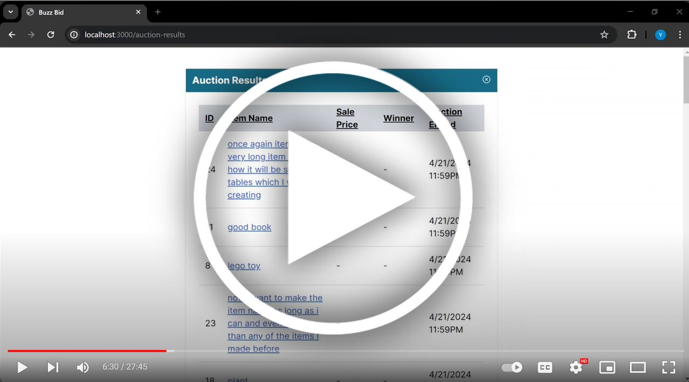

# Muti-Users Interactive Auction System

Role-based access and Admin panels included

## Getting Started

These instructions will get you a copy of the project up and running on your local machine for development and testing purposes.

### Prerequisites

What things you need to install the software and how to install them:

- Docker
- Node.js
- npm

### Installing

A step-by-step series of examples that tell you how to get a development environment running:

#### Setting up the PostgreSQL Database

1. Open Docker.
2. Change directory to the database setup:
   ```bash
   cd db
   ```
3. Build the PostgreSQL Docker image:
   ```bash
   docker build -t my_postgres .
   ```
4. Run the PostgreSQL image:
   ```bash
   docker run --name my_postgres_instance -p 5432:5432 my_postgres
   ```

#### Running the Next.js App

1. In the project root, change to the app directory:
   ```bash
   cd app
   ```
2. Install dependencies (if not already done):
   ```bash
   npm install
   ```
3. Start the development server:
   ```bash
   npm run dev
   ```

### Accessing the Application

Open your web browser and visit [http://localhost:3000](http://localhost:3000) to view the app.

#### Useful commends

1. Clear all docker containers and volumes:
   ```bash
   docker stop $(docker ps -aq) ; docker rm $(docker ps -aq) ; docker volume rm $(docker volume ls -q) ; docker rmi $(docker images -q) -f
   ```

2. Login psql database (password: pwd):
   ```bash
   psql -h localhost -p 5432 -d cs6400_sp24_team036 -U postgres
   ```

#### Demo
[](https://www.youtube.com/watch?v=0DahHkGtQMs)

